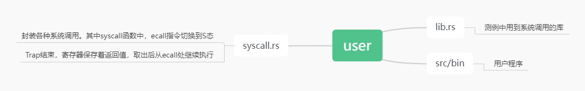
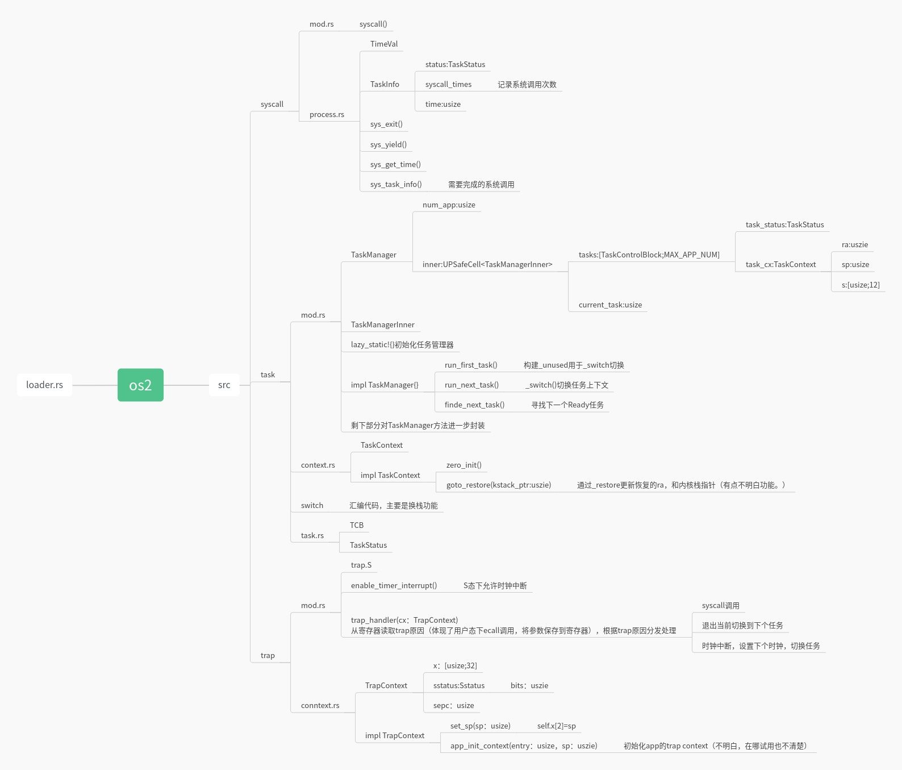

### 第二章-批处理系统

#### 1.应用程序

该项目属于Test仓库，`clone`后命名为`user`，用于放置用户程序和实验的测例，供内核执行。

##### 1.1标准库

测例中使用到`user_lib`库的`API`,是`user`目录下的`lib.rs`文件，设置名字后作为用户程序的标准库使用


##### 1.2内存布局

`user/src/linker.ld`l链接脚本设置三个用户程序在一个固定的物理地址上运行，**lib.rs定义的_start函数的指令被放在整个程序的开头，批处理系统加再完应用后，就跳转道用户库_start函数**


##### 1.3系统调用

子模块`syscall`中通过`ecall指令触发ExceptionEvnCall`的中断然后`Trap`进入S态，处理这个中断。第二章新增了```sys_write和sys_exit```系统调用

按照 RISC-V调用规范，在合适寄存器存放参数，通过`ecall`指令触发`Trap`。`Trap`结束之后,回到U态，继续从`ecall`的下条指令开始执行，并从合适的寄存器中读取返回值


约定寄存器`a0~a2`保存系统调用参数，寄存器`a7`保存syscall ID。返回后，通过寄存器`a0`传递值给局部变量ret，ret随后作为函数值返还


##### 1.4封装`write`和`exit`系统调用

##### 1.5编译生成应用程序二进制代码


### 2.批处理系统

#### 2.1将程序加载到内存

`link_app.S`汇编代码将应用程序的二进制代码加载到内核


* `batch`模块内的`AppManager`结构体，通过`link_app.S`中的`_num_app`来解析应用数量和地址，并初始化一个实例

* `lazy_static!`宏让全局变量可以在运行时再进行初始化，对应此处是初始化`AppManager`变量

* `impl AppManager`的`load_app`是根据`app_id`将对应程序二进制镜像加载到**特定地址的物理**内存上

  

`batch`对外接口。`init`第一次使用`AppManager`，初始化。`run_next_app`批处理系统加载并运行下一个程序


### 3.特权级切换

| CSR 名  | 该 CSR 与 Trap 相关的功能                                    |
| ------- | ------------------------------------------------------------ |
| sstatus | `SPP` 等字段给出 Trap 发生之前 CPU 处在哪个特权级（S/U）等信息 |
| sepc    | 当 Trap 是一个异常的时候，记录 Trap 发生之前执行的最后一条指令的地址 |
| scause  | 描述 Trap 的原因                                             |
| stval   | 给出 Trap 附加信息                                           |
| stvec   | 控制 Trap 处理代码的入口地址                                 |

**Q：对于各种寄存器，单从字面意思不懂保存的那些数据，具体是干嘛的，或者各个寄存器是联系不起来**

Trap触发后，通过内核栈保存原控制流寄存器状态，由于S和U态特权情况不一样，cpu在处理时，可能调用其他模块，因此**所有寄存器（x[usize;32],sstatus,sepc）都保存比较稳妥**


#### Trap处理入口

修改stvec寄存器保存trap入口为`__alltraps`。

Trap总的流程：首先通过 `__alltraps` 将 Trap 上下文保存在内核栈上，然后跳转到使用 Rust 编写的 `trap_handler` 函数 完成 Trap 分发及处理。当 `trap_handler` 返回之后，使用 `__restore` 从保存在内核栈上的 Trap 上下文恢复寄存器。最后通过一条 `sret` 指令回到应用程序执行。


#### trap_handler()实现分发处理

根据Trap的原因（scause.cause()）分发：**syscall再根据syscall_id分发到具体函数处理。传递的args参数也会转化成具体类型处理**


#### 执行用户程序

在 RISC-V 架构中，唯一一种能够使得 CPU 特权级下降的方法就是通过 Trap 返回系列指令，比如 `sret` 。

运行用户程序前：

- 跳转到应用程序入口点 `0x80400000`；
- 将使用的栈切换到用户栈；
- 在 `__alltraps` 时我们要求 `sscratch` 指向内核栈，这个也需要在此时完成；
- 从 S 特权级切换到 U 特权级。

以上都在`_restore`实现


### 4.思维导图

模块与模块间的结构体，方法，API太多，混乱，做个导图方便查看和梳理

#### user仓库




#### os2（batch操作系统）



### chapter3实验练习

第三章实验练习的大概目标是：自己在os内核源码下新增一个展示任务信息的系统调用，使user仓库下的一个`ch3_taskinfo.rs`用户态程序能够通过编译并且顺利运行。


#### 1.ch3分支的内核执行用户程序的流程

U态切换S态的过程。用户程序发起系统调用，在`ecall`指令处`trap`进os内核。然后S态下`__alltraps`先将任务上下文保存进内核栈，再将栈顶指针交给`tanp_handler`，随后该函数分析中断和异常。用户中断则根据syscall_id进行分发处理（这期间有可能调用`__switch:`换栈，**就是一个应用的Trap流 A切换到另一个Trap流程 B，`__switch:`调用完毕后，再从一个Trap控制流C切回来**），处理完毕后通过`__restore:`恢复到U态。**在此，开始编写一个新的系统调用来满足分发处理**


#### 2.编写 sys_task_info(ti: *mut TaskInfo) 系统调用

##### 2.1

使`user/src/bin/ch3_taskinfo.rs`中`assert_eq!(0, task_info(&info));`宏通过编译。

S态的系统调用，一般成功完成则返回0，失败返回-1，所以我们将`os/src/syscall/process.rs`内`sys_task_info(ti: *mut TaskInfo)`函数的返回值先改为0即可。

##### 2.2统计系统调用次数

**Q：从第一章到目前为止，大多数内容都是在介绍内核各模块。然而我主要是还不理解，具体的os内核和用户程序调用流程是什么，怎么运行起来的**

**Q：TaskManager内含TCB任务控制块，怎么做到在内核中通过TCB来记录任务情况，并且修改TaskContext任务上下文**

**Q：内核模块的功能了解差不多，但模块间怎么配合跟协作是主要问题**