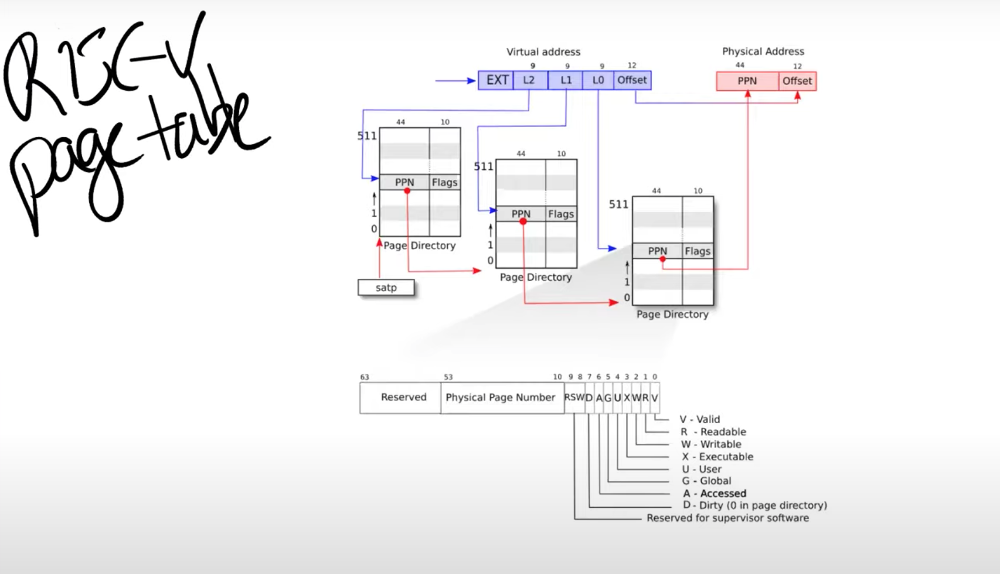

# 虚拟内存技术

## 地址与页表概念

* 虚拟地址与物理地址

* 地址的格式（页号+偏移）

* 页表，多级页表

* 页表项数据结构（多级PPN+标志位）

  

## 物理页帧管理

* 维护一个PPN区间用于分配，栈结构管理分配的PPN（分配内存时根据一定规则分配PPN）
* 封装分配器，对外暴露一个接口

## 多级页表

* 映射（通过map方法插入一个映射）
  * 恒等映射
  * 页表映射
* 访问物理页帧
  * 物理页号转成物理地址再转为裸指针访问内存
* 映射建立和拆除
  * `find_pte_create`方法获取虚拟页号的三级索引，逐级查找
* 翻译地址
  * `tanslate`封装`find_pte`，它唯一不同之处在于不会试图分配页帧，而是返回`None`

## 逻辑段

* 一系列连续的虚拟地址
  * .bss、.text、.data等

## 地址空间

* 一系列有关联的逻辑段
  * 内核空间，应用空间等
  * 达到内存隔离目的

## 内核地址空间

* 高256G为跳板、用户程序内核栈()

  

* 低256G为内核空间的多个段

## 应用地址空间

* 高256G为跳板和TrapContext

  

* 低256G为用户栈和各段

## 创建内核地址空间

* 初始化堆分配器、页帧分配器、**第一次引用内核空间**
  * 在分页模式开启前后，保证物理地址取指的连续性
  * `taken`构造内核地址的`satp`，并写入`satp CSR`
  * 一段汇编清理掉`MMU`的**快表**

## 跳板：实现内核和应用地址空间的平滑切换

* 为什么有跳板？为何不把`TrapContext`放内核栈？
  * 为了避免切换到内核空间保存Trap上下文，**更重要的是切换过程要保存内核空间token和内核栈顶，而只有一个sscratch寄存器不够周转（其实这里有点小疑惑，直接将内核token写入satp不就可以了吗？内核栈顶用sscratch。也可能是这样会丢失用户token，待会不能切换回用户）**，于是将`TrapContext`保存在应用地址空间
    * `TrapContext`新增三个字段：`kernel_satp`(内核空间token)、`kernel_sp`、`trap_handler`，内核在每个应用空间写入后不再变化

* 内核和应用空间的跳板页面**均位于同样位置**，被映射到同一个物理页帧
  * 比如刚Trap进入S态，却在应用地址空间，这时候取应用空间跳板页面的指令，即`_alltraps`和`_restore`等负责切换地址空间的汇编代码所在的页面。

## 扩展任务控制器

* TCB新增`memory_set`、`trap_cx_ppn`、`base_size`（应用大小，目前没用）

* `trap_handler()`中需要Trap上下文。`trap_return()`需要用户空间token。新增`current_user_token（）`、`current_trap_cx（）`

## 改进Trap处理

* 通过`current_trap_cx`获取Trap上下文，正常进行处理，最后`trap_return`
* `trap_return`准备好用户空间token和Trap位置参数，计算出`_restore`虚拟地址并调用
  * `_restore`在跳板页帧中，大概布局是跳板开始处为`_alltraps`，然后是`_restore`

## 改进sys_write

页表模块提供`translated_byte_buffer(token,ptr,len)`：在内核空间将用户空间的一块缓冲区翻译成字符数组，用于打印时候转化成&str并输出

## ch4实验

### 重写 sys_get_time 

思路：内核态syscall模块通过`TASK_MANAGER`对传进来的参数地址进行页表查询，将其物理地址返回，以供`sys_get_time`系统调用写入数据

1. 在`impl TaskManager`内新增`find_pa`系统调用，参数是`TASK_MANAGER`和用户态传入的`TimeVal`结构体，功能是手动查询用户空间页表，将结构体所在的物理地址返回。然后进一步封装成公共函数接口，对外调用。
2. syscall模块将时间等信息写入`find_pa`获取的物理地址

###  sys_task_info
